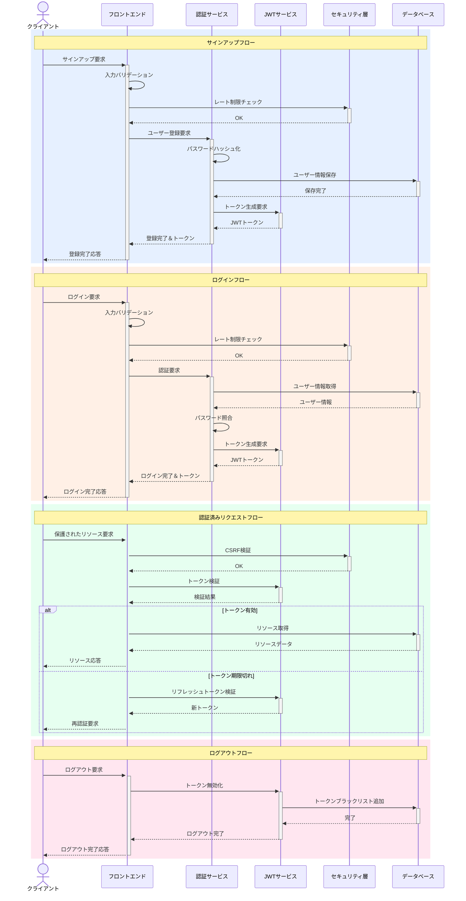

# Golf App

## 認証フロー図



## 認証フローの説明

### 各コンポーネントの役割

1. **クライアント**
   - ユーザーからの各種リクエスト発行
   - レスポンスの受信と表示

2. **フロントエンド**
   - 入力バリデーション
   - トークン管理
   - UIの状態管理

3. **認証サービス**
   - ユーザー認証ロジック
   - パスワードハッシュ化
   - 認証フロー制御

4. **JWTサービス**
   - トークンの生成
   - トークンの検証
   - リフレッシュトークン管理

5. **セキュリティ層**
   - レート制限
   - CSRF対策
   - セキュリティチェック

6. **データベース**
   - ユーザー情報の永続化
   - トークンブラックリスト管理
   - リソースデータの管理

### フロー種別

- **サインアップフロー**: 新規ユーザー登録プロセス
- **ログインフロー**: 既存ユーザーの認証プロセス
- **認証済みリクエストフロー**: 保護されたリソースへのアクセス
- **ログアウトフロー**: セッション終了とトークン無効化

## 開発環境

### システム要件
- Node.js 18.x以上
- npm 9.x以上
- SQLite 3.x

### 開発環境セットアップ
```bash
# リポジトリのクローン
git clone [repository-url]
cd [project-name]

# 依存パッケージのインストール
npm install

# 開発サーバーの起動
npm run dev

# APIサーバーの起動
npm run server
```

### 環境変数の設定
```env
# .env
NODE_ENV=development
JWT_SECRET=your-jwt-secret
API_URL=http://localhost:3000

# データベース設定
DB_PATH=./data/development.sqlite
```

### 開発用スクリプト
```bash
# 開発サーバー起動
npm run dev

# ビルド
npm run build

# テスト実行
npm run test

# リント
npm run lint
```

## インストール方法

[インストール手順をここに追加]

## 使用技術

### 技術移行計画

| コンポーネント | 現状 | 移行後 | 役割 |
|------------|------|--------|------|
| フロントエンド | Vue.js 2.7.16 + Vuetify 2.6.0 | Vue.js + Vuetify | 入力・トークン保存・UI制御 |
| 認証基盤 | Firebase Auth 8.10.1 | Node.js + Express | APIルーティング・認証処理本体 |
| データベース | Cloud Firestore | SQLite | ユーザー・データの永続化 |
| トークン管理 | Firebase Token | jsonwebtoken | トークンの生成・検証 |
| 暗号化処理 | Firebase Auth組込 | bcrypt | パスワードのハッシュ化・照合 |

### 現状の技術スタック

#### フロントエンド
- Vue.js 2.7.16
- Vuetify 2.6.0
- Vue Router 3.5.1
- Vuex 3.6.2

#### バックエンド
- Firebase 8.10.1
  - Authentication
  - Cloud Firestore
  - Hosting

### 移行後の技術スタック

#### フロントエンド
- Vue.js
- Vuetify
- Vue Router
- Vuex

#### バックエンド
- Node.js + Express
- SQLite
- jsonwebtoken（JWT認証）
- bcrypt（パスワードハッシュ化）


### セキュリティ考慮事項
- JWTトークンの適切な有効期限設定
- パスワードの安全なハッシュ化
- クロスサイトリクエストフォージェリ（CSRF）対策
- レート制限の実装
- セキュアなセッション管理
